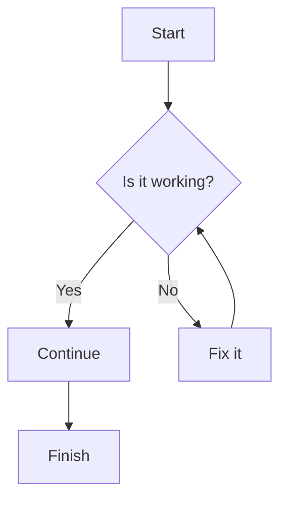

```
from fire2a.aggclust import agglomerative_clustering_data_list
# data_list is a list of 2d numpy arrays
labels_reshaped, clustering = agglomerative_clustering_data_list(*data_list, **kwargs)
```

diagram here:

end

# temas
- nodata
   - no
   - methods: mean, median, mode, min, max
- scaling
   - no
   - methods: OneHot, RobustScaling, StandardScaler
- cluster algo
   - agglomerative
   - hdbscan

| filename | nodata | scaling |
| --- | --- | --- |
| fuels | mode | onehot |
| elevation | mean | robust |

# Configuration File Format (config.toml)
The config.toml file is used to specify preprocessing options for each data file that will be processed by the clustering algorithm. Each file's settings are grouped under its filename, and the nodata and scaling options are optional. The format is as follows:

Options
filename.ext: The name of the data file (e.g., data.csv, elevation.tif). Each file's settings are specified under its filename.
nodata: (Optional) Specifies the method to handle missing data. Possible values are:
"no": Do not handle missing data.
"mean": Replace missing values with the mean of the column.
"median": Replace missing values with the median of the column.
"mode": Replace missing values with the mode of the column.
"min": Replace missing values with the minimum value of the column.
"max": Replace missing values with the maximum value of the column.

   - [HDBSCAN](https://scikit-learn.org/stable/modules/generated/sklearn.cluster.HDBSCAN.html)
